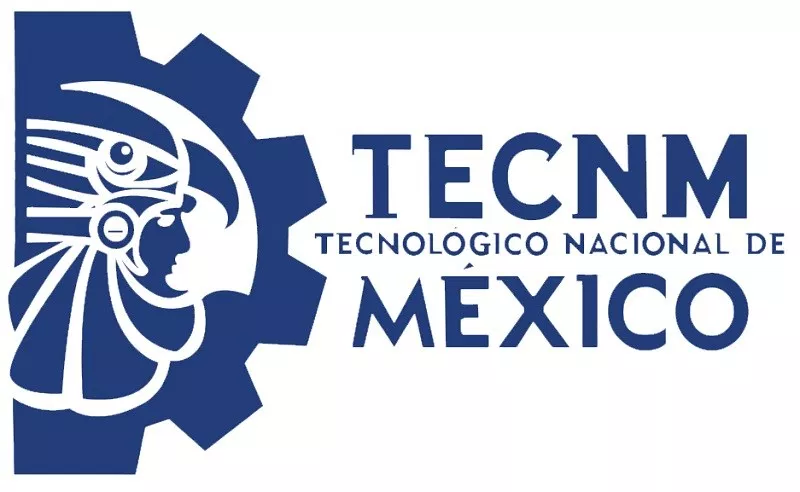

# Repo de Centro de Cómputo Unidad Otay

#Gparted para RESIZE 100gb

# Ubuntu Setup de Labs
```
sudo add-apt-repository ppa:danielrichter2007/grub-customizer
sudo apt-get update
sudo apt-get install grub-customizer gdebi-core -y &
wget https://dl.google.com/linux/direct/google-chrome-stable_current_amd64.deb 
sudo gdebi google-chrome-stable_current_amd64.deb -y
```

## Poner Logotipo en GrubCustomizer  /home/estudiante/(directorio)
### Windows DEFAULT a 120 seg
### Resolucion 1600x1200
### Resaltado: Fondo VERDE

# son como 200mb de actualizaciones
sudo apt-get upgrade -y 


# Chrome con Incognito por default
sudo update-alternatives --config x-www-browser
Seleccionar CERO

# Borrar y crear este archivo para INCOGNITO, preciona con CTRL+Y, y pegar el contenido de abajo.
sudo nano /usr/share/applications/google-chrome.desktop  

*Reemplazo*
```
#!/usr/bin/env xdg-open
[Desktop Entry]
Version=1.0
Name=Chorme incognito
Exec=/opt/google/chrome/google-chrome --incognito
Terminal=false
Icon=google-chrome
Type=Application
Categories=Network;WebBrowser;
MimeType=text/html;text/xml;application/xhtml_xml;x-scheme-handler/http;x-scheme-handler/https;x-scheme-handler/ftp;
```
